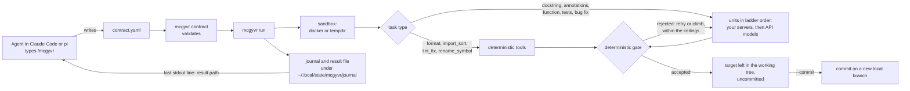

# mcgyvr

[](https://github.com/AdarGit008/mcgyvr/actions/workflows/ci.yml)
[](LICENSE)

mcgyvr is a command-line tool and an agent skill. Your agent hands it one
scoped coding task: reformat a file, sort imports, rename a symbol, write a
docstring, a function, its tests or a bug fix. mcgyvr runs that task on the
cheapest worker you allow and keeps an answer only if it passes a
deterministic gate.

- **Cost.** Format, import sort, lint fix and rename start on deterministic
  tools (the project's formatter, import sorter and linter, and mcgyvr's own
  index), not on a model. Model tasks climb a ladder of units that you list
  cheapest first, within ceilings you set.
- **Local first.** You bind the units. A setup can name only llama.cpp or
  vLLM servers on your own machines; API models are optional.
- **Gated results.** Deterministic checks judge every answer before it
  reaches your tree, and an accepted change stays uncommitted unless you ask
  for a commit.
- **Who it is for:** people working in Claude Code or pi who want to hand
  bounded edits to cheaper workers, especially if they already serve models on
  their own GPUs.

## Prerequisites

| Need | Why |
| --- | --- |
| Python 3.12 or newer, and [uv](https://docs.astral.sh/uv/) | `requires-python = ">=3.12"`; the install command below uses uv |
| git | the repository a task runs against must be a git checkout |
| The project's own tools on `PATH` | tool task types run them; the quickstart's `format` task ran `ruff format` |
| At least one unit, for model task types | a local OpenAI-compatible server (llama.cpp or vLLM), or an API model whose key is in an environment variable |
| Docker (optional) | task commands run in a throwaway container by default; with no Docker daemon, `mcgyvr run` falls back to `tempdir` and says so |

## Install

### 1. The CLI

Install the CLI, then check that it runs:

```sh
uv tool install mcgyvr
mcgyvr --help
```

```text
usage: mcgyvr [-h] [--version]
              {capabilities,caps,config,pool,catalog,contract,detect,scan,serve,emit,sandbox,init,attach,index,resolve,read,fleet,run,delegate}
              ...

Offload scoped coding work to a configurable worker ladder.
```

That installs the latest release. To run `main` as it stands instead — work
merged since that release and not yet tagged — install from the repository:

```sh
uv tool install git+https://github.com/AdarGit008/mcgyvr
```

### 2. The skill

`install.sh` copies the skill out of a checkout, into both harnesses at once:

```sh
git clone --depth 1 https://github.com/AdarGit008/mcgyvr
bash mcgyvr/skills/mcgyvr/install.sh
```

```text
installed: ~/.claude/skills/mcgyvr/SKILL.md
installed: ~/.claude/skills/mcgyvr/references/examples.md
installed: ~/.pi/agent/skills/mcgyvr/SKILL.md
installed: ~/.pi/agent/skills/mcgyvr/references/examples.md
setup: skills/mcgyvr/SETUP.md
cli: uv tool install git+https://github.com/AdarGit008/mcgyvr
Invoke it with /mcgyvr; it does not load itself.
```

It also checks the `mcgyvr` on `PATH` against the oldest release the skill is
known to drive, and warns on stderr — never refuses — when there is no binary,
when it is older, or when it reports `0.0.0+uninstalled`. Installing the
instructions on a machine that does not have the CLI yet is the ordinary first
case, and the `cli:` line above is how it is closed.

| Flag | Effect |
| --- | --- |
| (none) | install, or upgrade a copy this script installed; running it twice changes nothing |
| `--force` | overwrite an installed copy that was edited by hand, which is otherwise refused |
| `--uninstall` | remove the skill from both harnesses; uninstalling twice is not an error |
| `--help` | print the usage |

It copies `SKILL.md` and `references/`, never `SETUP.md`. The skill sets
`disable-model-invocation: true`, so an agent uses it only when you type
`/mcgyvr`.

## Quickstart

Real output from a machine with no local model server. `~` is that run's home
directory.

**1. Set up the machine.** `mcgyvr init` looks for model servers and writes
`fleet.yaml` and `policy.yaml`. With nothing answering, it refuses (exit 1),
writes nothing, and lists the fixes:

```text
$ mcgyvr init
error: Refusing to write a config that cannot load.

No local backend answered on any default endpoint. With no GPU this build can see, no unit can be proposed, and a config with no unit or no ladder dispatches nowhere.
```

One of those fixes is `--api`, which binds a hosted unit and needs no GPU and
no local backend. It writes the same two files any other init writes, here
into `~/setup`:

```text
$ mcgyvr init --api model=claude-opus-5,address=https://api.anthropic.com,api_key_env=ANTHROPIC_API_KEY ~/setup
Wrote ~/setup

What was decided, and why:
  - api_claude-opus-5 -> claude-opus-5 at https://api.anthropic.com: bound because `--api` asked for it, not because anything was detected. Its key is read from $ANTHROPIC_API_KEY at dispatch and is never written to these files.
```

`api_key_env` is the NAME of the environment variable holding your key; the
key itself is never written to either file, and init never reads it.

From `~/setup`, `mcgyvr pool` reads the setup back:

```text
$ mcgyvr pool
~/setup: 1 usable rung(s), cheapest first:

  api_claude-opus-5    api            1 attempt   claude-opus-5

  Ceiling: at most 1 escalation(s) — 1 of these 1 rung(s) — and at most 1 attempt(s) per task (the ladder's own budget).
```

Every key of both files is documented in
[`skills/mcgyvr/SETUP.md`](skills/mcgyvr/SETUP.md).

**2. Write a contract and validate it.** In a git checkout that holds
`src/pkg/messy.py`:

```yaml
# format.yaml
id: format-pkg
task_type: format
task: Reformat the module with the project's formatter.
target: src/pkg/messy.py
scope:
  allow: ["src/pkg/**"]
```

```text
$ mcgyvr contract format.yaml
format.yaml: valid

  format-pkg  [format] — deterministic tier
  target:  src/pkg/messy.py
  allow:   src/pkg/**
  risk:    medium — verified by gate only
  limits:  <=256 output tokens, <=4096 prompt tokens, 2 attempt(s)
  acceptance: none declared — the gate's own checks decide
```

`mcgyvr catalog` lists all nine task types with what each guarantees, and
[`skills/mcgyvr/references/examples.md`](skills/mcgyvr/references/examples.md)
has one minimal contract per type.

**3. Run it.** Inside Claude Code the session is detected. In a plain shell,
name the writer with `--orchestrator`:

```text
$ mcgyvr run format.yaml --repo . --config ~/setup --sandbox tempdir --orchestrator demo
journal: ~/.local/state/mcgyvr/journal/demo.jsonl
note: This is the explicitly weaker mode: acceptance commands are arbitrary shell from a contract and run on the host, not inside a container. Credentials are still kept out and each task still gets a throwaway git workspace, but process, network and resource isolation are the host's.
  $ ruff format -- src/pkg/messy.py

format-pkg: gate accepted

Left in src/pkg/messy.py, not committed (pass --commit to commit).
result: ~/.local/state/mcgyvr/journal/results/format-pkg-20260915T022555.432380Z.json
```

The exit code was 0, the result file says `"outcome": "accepted"` and
`"committed": false`, and `git diff --stat` shows the one reformatted file.
This task ran on a tool, so no API key was needed and no model was called.

The last stdout line always names the result file. Its `outcome` words, what
to do after each, and the exit codes are in
[`skills/mcgyvr/SKILL.md`](skills/mcgyvr/SKILL.md).

## How a task is delivered



## Harnesses

| Harness | Skill installed to | How a run names its session | Status |
| --- | --- | --- | --- |
| Claude Code | `~/.claude/skills/mcgyvr/` | `CLAUDE_CODE_SESSION_ID`, read automatically | Supported |
| pi | `~/.pi/agent/skills/mcgyvr/` | `PI_SESSION_FILE`, which a mcgyvr-session pi extension would set; that extension is not in this repository, so pass `--orchestrator ID` to `mcgyvr run` | Skill installs; runs need `--orchestrator` |
| Codex and others | not installed | none | Out of scope for now (`tests/test_skill_packaging.py`) |

## Side effects and data flow

| What | Behaviour, and how to turn it off |
| --- | --- |
| Your repository | `mcgyvr run` writes only the contract's `target` and leaves it uncommitted. `--commit` commits it; with the default `delivery.mode: branch` that is a new local branch, and your checkout, index and working tree stay as they were. Nothing is pushed, and mcgyvr has no forge access. |
| Journal | Every run appends to `<orchestrator>.jsonl` under `journal.dir` (default `~/.local/state/mcgyvr/journal`), with prompts and replies under `blobs/` and result files under `results/`. It never lands in the repository. `--record DIR` adds a second copy. |
| Data leaving the machine | A model task sends the contract, including the target's current content, to the unit it runs on: a server you bound, or an API model's `address`. A tool task that its tool finishes calls no unit. |
| API keys | A setup names the environment variable (`api_key_env`), never the key. Task commands run with every credential-shaped variable removed (`src/mcgyvr/sandbox/base.py`). |
| Network probes | `mcgyvr init` probes default local endpoints, plus machines you name with `--host`. `mcgyvr pool --probe` asks each unit whether it answers; it is off by default, because it spends. |
| Your GPU machines | `serving.enable_sleep_wake` is `false` by default. Set to `true`, it lets `mcgyvr run` stop and start containers on a machine others may share. `mcgyvr serve sleep` and `mcgyvr serve wake` act only when you type them. |
| Task commands | They run in a throwaway container (`sandbox.mode: docker`, the default), or with `tempdir` on the host in a throwaway git workspace. |
| Cost | Bounded, not estimated: `max_escalations` (default 1), `max_attempts`, `task_timeout_s` (default 900 seconds) and each model contract's `limits.max_output_tokens`. |

## Repository map

| Path | What it is |
| --- | --- |
| `src/mcgyvr/` | the CLI package |
| `skills/mcgyvr/` | the skill: `SKILL.md` and `references/` (installed), `SETUP.md` (machine setup, not installed) and `install.sh`; the three documents are generated by `make docs` |
| `data/` | the capability table and task catalog, shipped inside the wheel |
| `examples/` | an example `fleet.yaml` and `policy.yaml` |
| `tests/` | the test suite |
| `tools/` | measurement, benchmark and journal-review scripts for developing mcgyvr; not in the wheel |
| `records/` | measurements, evidence, corpora and fleet locks that tests and tools read; `records/evidence/ghostcall-2026-08-02/` is the vendored engine the semantic check stages |
| `archive/` | the archived files that tests, tools and data still read or cite |
| `fleet-setup/` | a stamped two-machine setup that tests use as fixtures |
| `okf/` | rules for agents developing mcgyvr on the owner's machines |
| `docs/` | internal review notes |
| `.github/repo-baseline.md` | the checklist this repository is aligned against |
| [`CHANGELOG.md`](CHANGELOG.md), [`SECURITY.md`](SECURITY.md), [`LICENSE`](LICENSE) | changes, how to report a vulnerability, MIT license |

Research notes, plans, session logs and superseded code moved to
[AdarGit008/mcgyvr-lab](https://github.com/AdarGit008/mcgyvr-lab), under
unchanged paths. A comment here that cites
`mcgyvr-lab/<path>` points at that file there.

## Development

```sh
make setup   # install dependencies, frozen against uv.lock
make check   # ruff check, ruff format --check, mypy, docgen --check, pytest: what CI runs
make docs    # regenerate SKILL.md, SETUP.md and references/examples.md
```
